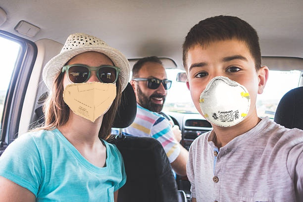
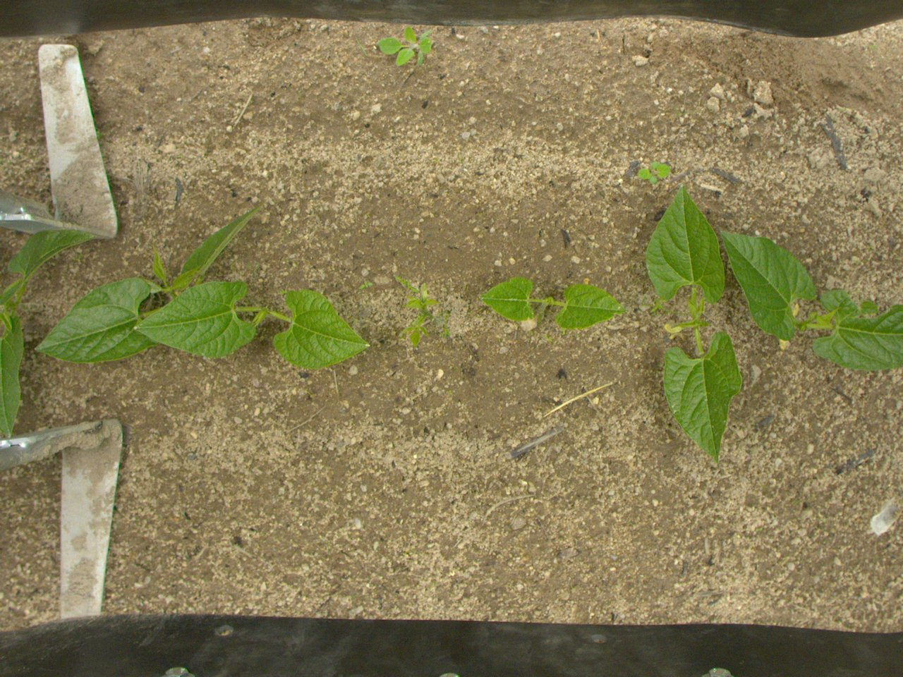
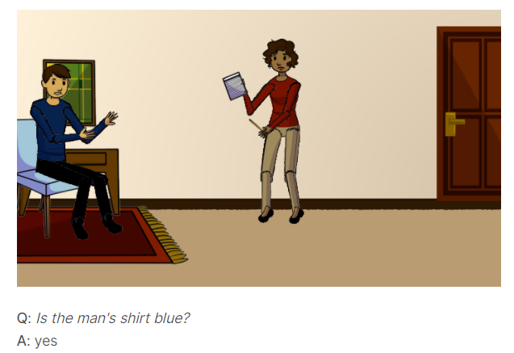

# Artificial Neural Networks and Deep Learning Competition

This repository contains the Jupyter Notebooks that we created for the competition hosted by the [*Artificial Neural Network and Deep Learning*](http://chrome.ws.dei.polimi.it/index.php?title=Artificial_Neural_Networks_and_Deep_Learning) course at [Politecnico di Milano](https://www.polimi.it/) in the academic year 2020-2021.

The competition was divided into three challenges, each one of them cover a different topic of the course:
- Image Classification
- Image Segmentation
- Visual Question Answering

## Image Classification

The goal of the challenge is to classify images of people wearing masks into one of three classes:
- **Everyone** in the image are wearing a mask
- **No one** in the image is wearing a mask
- **Someone** in the image is not wearing a mask.

**Dataset**: 5614 images in the training set, 450 images in the test set

**Evaluation**: Multiclass Accuracy 96%

[Here](https://github.com/LorenzoMainetti/artificial-neural-networks-and-deep-learning-challenges-2020-2021/blob/main/1%20-%20Image%20Classification/ANN%20Challenge%201.pdf) is a complete description on how we approached the challenge and how we got our best model.

## Image Segmentation

The goal of the challenge is to perform precise automatic crop and weed segmentation for the agricoltural sector.\
The images contained two different crop types: Mais or Haricot.
The segmented objects can belong to one of three classes:
- **Background**, defined as label 0 and has RGB pixel [0, 0, 0] and [254, 124, 18]
- **Crop**, defined as label 1 and has RGB pixel [255, 255, 255]
- **Weed**, defined as label 2 and has RGB pixel [216, 67, 82]

**Datasets**: integration of 4 widely different datasets of pictures and masks coming from the [ROSE challenge](http://challenge-rose.fr/en/home/)

**Evaluation**: Intersection over Union 50.83%

|  |  |
|:---:|:---:| 
| Input image | Target mask |

[Here](https://github.com/LorenzoMainetti/artificial-neural-networks-and-deep-learning-challenges-2020-2021/blob/main/2%20-%20Image%20Segmentation/ANN%20Challenge%202_Final.pdf) is a complete description on how we approached the challenge and how we got our best model.

## Visual Question Answering

The goal of the challenge is to answer questions using the information provided by the corresponding image and question pair. The given input is an image and an associated question about it, and the output is an answer, belonging to one of three possible categories: 'yes/no', 'counting' (from 0 to 5) and 'other' (e.g. colors, location, ecc.).

**Dataset**: 58832 questions in training set, 29333 total images (size: 400x700), 6372 questions for testing

**Evaluation**: Multiclass Accuracy 62.34%

[Here](https://github.com/LorenzoMainetti/artificial-neural-networks-and-deep-learning-challenges-2020-2021/blob/main/3%20-%20Visual%20Question%20Answering/ANN%20Challenge%203.pdf) is a complete description on how we approached the challenge and how we got our best model.

## Group Members
- [__Leonardo Giusti__](https://github.com/giusti-leo)
- [__Francesco Govigli__](https://github.com/FrancescoGovigli)
- [__Lorenzo Mainetti__](https://github.com/LorenzoMainetti)
